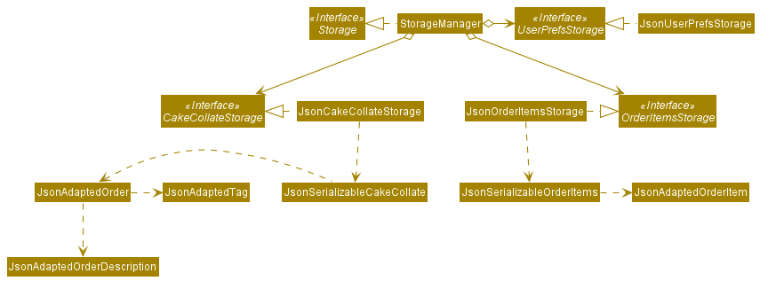
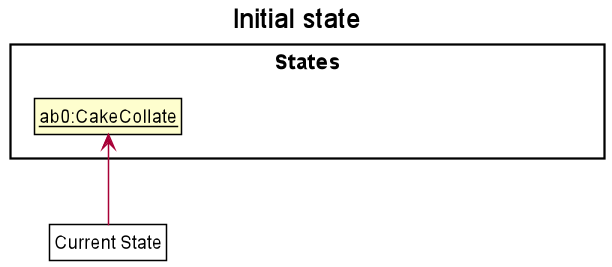
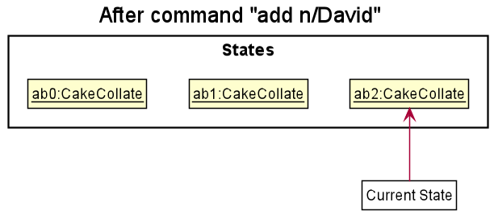
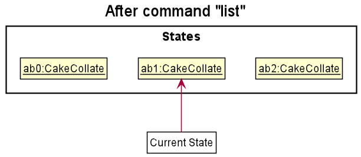

* Table of Contents
{:toc}

--------------------------------------------------------------------------------------------------------------------

## **Setting up, getting started**

Refer to the guide [_Setting up and getting started_](SettingUp.md).

--------------------------------------------------------------------------------------------------------------------

## **Design**

### Architecture

The ***Architecture Diagram*** given above explains the high-level design of the App. Given below is a quick overview of each component.

:bulb: **Tip:** The `.puml` files used to create diagrams in this document can be found in the [diagrams](https://github.com/se-edu/addressbook-level3/tree/master/docs/diagrams/) folder. Refer to the [_PlantUML Tutorial_ at se-edu/guides](https://se-education.org/guides/tutorials/plantUml.html) to learn how to create and edit diagrams.

**`Main`** has two classes called [`Main`](https://github.com/se-edu/addressbook-level3/tree/master/src/main/java/seedu/address/Main.java) and [`MainApp`](https://github.com/se-edu/addressbook-level3/tree/master/src/main/java/seedu/address/MainApp.java). It is responsible for,
* At app launch: Initializes the components in the correct sequence, and connects them up with each other.
* At shut down: Shuts down the components and invokes cleanup methods where necessary.

[**`Commons`**](#common-classes) represents a collection of classes used by multiple other components.

The rest of the App consists of four components.

* [**`UI`**](#ui-component): The UI of the App.
* [**`Logic`**](#logic-component): The command executor.
* [**`Model`**](#model-component): Holds the data of the App in memory.
* [**`Storage`**](#storage-component): Reads data from, and writes data to, the hard disk.

Each of the four components,

* defines its *API* in an `interface` with the same name as the Component.
* exposes its functionality using a concrete `{Component Name}Manager` class (which implements the corresponding API `interface` mentioned in the previous point.

For example, the `Logic` component (see the class diagram given below) defines its API in the `Logic.java` interface and exposes its functionality using the `LogicManager.java` class which implements the `Logic` interface.

**How the architecture components interact with each other**

The *Sequence Diagram* below shows how the components interact with each other for the scenario where the user issues the command `delete 1`.

The sections below give more details of each component.

### UI component

**API** :
[`Ui.java`](https://github.com/se-edu/addressbook-level3/tree/master/src/main/java/seedu/address/ui/Ui.java)

The UI consists of a `MainWindow` that is made up of parts e.g.`CommandBox`, `ResultDisplay`, `OrderListPanel`, `StatusBarFooter` etc. All these, including the `MainWindow`, inherit from the abstract `UiPart` class.

The `UI` component uses JavaFx UI framework. The layout of these UI parts are defined in matching `.fxml` files that are in the `src/main/resources/view` folder. For example, the layout of the [`MainWindow`](https://github.com/se-edu/addressbook-level3/tree/master/src/main/java/seedu/address/ui/MainWindow.java) is specified in [`MainWindow.fxml`](https://github.com/se-edu/addressbook-level3/tree/master/src/main/resources/view/MainWindow.fxml)

The `UI` component,

* Executes user commands using the `Logic` component.
* Listens for changes to `Model` data so that the UI can be updated with the modified data.

### Logic component

**API** :
[`Logic.java`](https://github.com/se-edu/addressbook-level3/tree/master/src/main/java/seedu/address/logic/Logic.java)

1. `Logic` uses the `CakeCollateParser` class to parse the user command.
1. This results in a `Command` object which is executed by the `LogicManager`.
1. The command execution can affect the `Model` (e.g. adding a order).
1. The result of the command execution is encapsulated as a `CommandResult` object which is passed back to the `Ui`.
1. In addition, the `CommandResult` object can also instruct the `Ui` to perform certain actions, such as displaying help to the user.

Given below is the Sequence Diagram for interactions within the `Logic` component for the `execute("delete 1")` API call.

:information_source: **Note:** The lifeline for `DeleteCommandParser` should end at the destroy marker (X) but due to a limitation of PlantUML, the lifeline reaches the end of diagram.

### Model component

**API** : [`Model.java`](https://github.com/se-edu/addressbook-level3/tree/master/src/main/java/seedu/address/model/Model.java)

The `Model`,

* stores a `UserPref` object that represents the user’s preferences.
* stores the cakecollate data.
* exposes an unmodifiable `ObservableList<Order>` that can be 'observed' e.g. the UI can be bound to this list so that the UI automatically updates when the data in the list change.
* does not depend on any of the other three components.

:information_source: **Note:** An alternative (arguably, a more OOP) model is given below. It has a `Tag` list in the `CakeCollate`, which `Order` references. This allows `CakeCollate` to only require one `Tag` object per unique `Tag`, instead of each `Order` needing their own `Tag` object. 

### Storage component

**API** : [`Storage.java`](https://github.com/se-edu/addressbook-level3/tree/master/src/main/java/seedu/address/storage/Storage.java)

The `Storage` component,
* can save `UserPref` objects in json format and read it back.
* can save the cakecollate data in json format and read it back.

### Common classes

Classes used by multiple components are in the `seedu.cakecollate.commons` package.

--------------------------------------------------------------------------------------------------------------------

## **Implementation**

This section describes some noteworthy details on how certain features are implemented.

### \[Proposed\] Undo/redo feature

#### Proposed Implementation

The proposed undo/redo mechanism is facilitated by `VersionedCakeCollate`. It extends `CakeCollate` with an undo/redo history, stored internally as an `cakeCollateStateList` and `currentStatePointer`. Additionally, it implements the following operations:

* `VersionedCakeCollate#commit()` — Saves the current cakecollate state in its history.
* `VersionedCakeCollate#undo()` — Restores the previous cakecollate state from its history.
* `VersionedCakeCollate#redo()` — Restores a previously undone cakecollate state from its history.

These operations are exposed in the `Model` interface as `Model#commitCakeCollate()`, `Model#undoCakeCollate()` and `Model#redoCakeCollate()` respectively.

Given below is an example usage scenario and how the undo/redo mechanism behaves at each step.

Step 1. The user launches the application for the first time. The `VersionedCakeCollate` will be initialized with the initial cakecollate state, and the `currentStatePointer` pointing to that single cakecollate state.

Step 2. The user executes `delete 5` command to delete the 5th order in the cakecollate. The `delete` command calls `Model#commitCakeCollate()`, causing the modified state of the cakecollate after the `delete 5` command executes to be saved in the `cakeCollateStateList`, and the `currentStatePointer` is shifted to the newly inserted cakecollate state.

Step 3. The user executes `add n/David …​` to add a new order. The `add` command also calls `Model#commitCakeCollate()`, causing another modified cakecollate state to be saved into the `cakeCollateStateList`.

:information_source: **Note:** If a command fails its execution, it will not call `Model#commitCakeCollate()`, so the cakecollate state will not be saved into the `cakeCollateStateList`.

Step 4. The user now decides that adding the order was a mistake, and decides to undo that action by executing the `undo` command. The `undo` command will call `Model#undoCakeCollate()`, which will shift the `currentStatePointer` once to the left, pointing it to the previous cakecollate state, and restores the cakecollate to that state.

:information_source: **Note:** If the `currentStatePointer` is at index 0, pointing to the initial CakeCollate state, then there are no previous CakeCollate states to restore. The `undo` command uses `Model#canUndoCakeCollate()` to check if this is the case. If so, it will return an error to the user rather
than attempting to perform the undo.

The following sequence diagram shows how the undo operation works:

:information_source: **Note:** The lifeline for `UndoCommand` should end at the destroy marker (X) but due to a limitation of PlantUML, the lifeline reaches the end of diagram.

The `redo` command does the opposite — it calls `Model#redoCakeCollate()`, which shifts the `currentStatePointer` once to the right, pointing to the previously undone state, and restores the cakecollate to that state.

:information_source: **Note:** If the `currentStatePointer` is at index `cakeCollateStateList.size() - 1`, pointing to the latest cakecollate state, then there are no undone CakeCollate states to restore. The `redo` command uses `Model#canRedoCakeCollate()` to check if this is the case. If so, it will return an error to the user rather than attempting to perform the redo.

Step 5. The user then decides to execute the command `list`. Commands that do not modify the cakecollate, such as `list`, will usually not call `Model#commitCakeCollate()`, `Model#undoCakeCollate()` or `Model#redoCakeCollate()`. Thus, the `cakeCollateStateList` remains unchanged.

Step 6. The user executes `clear`, which calls `Model#commitCakeCollate()`. Since the `currentStatePointer` is not pointing at the end of the `cakeCollateStateList`, all cakecollate states after the `currentStatePointer` will be purged. Reason: It no longer makes sense to redo the `add n/David …​` command. This is the behavior that most modern desktop applications follow.

The following activity diagram summarizes what happens when a user executes a new command:

#### Design consideration:

##### Aspect: How undo & redo executes

* **Alternative 1 (current choice):** Saves the entire cakecollate.
  * Pros: Easy to implement.
  * Cons: May have performance issues in terms of memory usage.

* **Alternative 2:** Individual command knows how to undo/redo by
  itself.
  * Pros: Will use less memory (e.g. for `delete`, just save the order being deleted).
  * Cons: We must ensure that the implementation of each individual command are correct.

_{more aspects and alternatives to be added}_

### \[Proposed\] Data archiving

_{Explain here how the data archiving feature will be implemented}_

--------------------------------------------------------------------------------------------------------------------

## **Documentation, logging, testing, configuration, dev-ops**

* [Documentation guide](Documentation.md)
* [Testing guide](Testing.md)
* [Logging guide](Logging.md)
* [Configuration guide](Configuration.md)
* [DevOps guide](DevOps.md)

--------------------------------------------------------------------------------------------------------------------

## **Appendix: Requirements**

### Product scope

**Target user profile**:

* small-time, home-based cake seller
* has a lot of orders to keep track of
* sells cakes on multiple platforms and wants to collect all orders in one place
* prefers desktop apps over other types
* can type fast
* prefers typing to mouse interactions
* is reasonably comfortable using CLI apps

**Value proposition**: keep track of and manage all orders placed on various online selling platforms in one place

### User stories

Priorities: High (must have) - `***`, Medium (nice to have) - `**`, Low (unlikely to have) - `*`

| Priority| As a …​                                   | I can …​                                                        | So that …​                                                                                |
|---------|----------------------------------------------|--------------------------------------------------------------------|----------------------------------------------------------------------------------------------|
| `***`   | User                                         | view all the possible commands that I can execute                  | I know what functionalities I can make use of when using the program                         |
| `***`   | User                                         | add orders for the day                                             | I can add new orders to my database                                                          |
| `***`   | User                                         | delete orders for the day                                          | I can remove unnecessary orders from my database                                             |
| `***`   | User                                         | list all my orders for the day                                     | I can view what orders I have to fulfil for the day                                          |
| `***`   | User                                         | retrieve data stored in the previous sessions                      | -                                                                                            |
| `***`   | User logging in after a long time            | delete all orders, reset the application                           | I can start on a clean slate since the previous orders are now meaningless to me             |
| `***`   | User                                         | load the app quickly                                               | I can access the data quickly                                                                |
| `**`    | Advanced user                                | use shortcuts and short forms                                      | I can reduce the time it takes to enter orders                                               |
| `**`    | User                                         | receive reminders for the orders due soon                          | I remember and complete them on time                                                         |
| `**`    | User who is at least slightly experienced    | delete multiple orders at one go                                   | I can reflect mass cancellations in my database if they occur                                |
| `**`    | User                                         | sort the orders according to which one needs to be completed first | I can prioritise the orders to work on for that day                                          |
| `**`    | User                                         | edit individual orders                                             | I can update orders if a customer changes it instead of deleting and adding another order    |
| `**`    | User                                         | add notes and special requests for orders                          | details on customized orders can be mentioned together with the main order                   |
| `**`    | User who loves statistics                    | view my most ordered products                                      | I know what to products to promote more                                                      |
| `**`    | Regular user                                 | be warned of duplicate orders I might have accidentally entered    | I can avoid making more than necessary, which may waste time and resources                   |
| `**`    | User                                         | find the orders made by a certain customer                         | I can retrieve information about the orders that this customer have made before, if needed   |
| `**`    | User                                         | input multiple order descriptions at one go                        | I don't need to input multiple entries for customers who order more than one type of cake    |
| `**`    | User                                         | set prices and costs of orders                                     | I can note how much profit I am earning                                                      |
| `*`     | User                                         | save a particular customer's information                           | I can quickly add another order from this customer next time                                 |
| `*`     | Regular user                                 | keep track of the money paid or owed by the customer               | I can ensure that all my dues have been received                                             |

[comment]: <> (# will need to add a few more based on new order model and any new features we decide on)

### Use cases

(For all use cases below, the **System** is `CakeCollate` and the **Actor** is the `user`, unless specified otherwise)

**Use case: Delete an order**

**MSS**

1.  User requests to list order
2.  CakeCollate shows a list of orders
3.  User requests to delete a specific order in the list
4.  CakeCollate deletes the order

    Use case ends.

**Extensions**

* 2a. The list is empty.

  Use case ends.

* 3a. The given index is invalid.

    * 3a1. CakeCollate shows an error message.

      Use case resumes at step 2.
      
**Use case: Add an order**

**MSS**

1.  User requests to list order
2.  CakeCollate shows a list of orders
3.  User requests to add a specific order in the list
4.  CakeCollate adds the order

    Use case ends.

**Use case: Edit an order**

**MSS**

1.  User requests to list order
2.  CakeCollate shows a list of orders
3.  User requests to edit a specific order in the list
4.  CakeCollate edits the order

    Use case ends.

**Extensions**

* 2a. The list is empty.

  Use case ends.

* 3a. The given index is invalid.

    * 3a1. CakeCollate shows an error message.

      Use case resumes at step 2.

### Non-Functional Requirements

* Constraints:
    * CakeCollate should be backward compatible with data produced by earlier releases.

* Technical requirements:
    * CakeCollate should work on any _mainstream OS_ on both 32-bit and 64-bit environments with Java `11` or above installed.

* Performance requirements:
    * CakeCollate should be able to hold up to 1000 orders without a noticeable sluggishness in performance for typical usage.
    * CakeCollate should response within two seconds for all commands.

* Quality requirements:
    * A user with above average typing speed for regular English text (i.e. not code, not system admin commands) should be able to accomplish most of the tasks faster using commands than using the mouse.
    * A user who does not have much experience with command line interface tools should still be able to use CakeCollate with the help of the _[User guide](UserGuide.md)_ and the `help` command in CakeCollate.
    * A user who is experienced with command line interface tools should find CakeCollate commands easy to use.

* Process requirements:
    * The project is expected to adhere to a schedule that delivers a feature set every two weeks.

*{More to be added}*

### Glossary

* **Mainstream OS**: Windows, Linux, Unix, OS-X
* **Private contact detail**: A contact detail that is not meant to be shared with others
* **MSS**: Main success scenario, lists the steps of a typical usage of the application by the user
* **Feature set**: A list of specifications and functionalities of the application

--------------------------------------------------------------------------------------------------------------------

## **Appendix: Instructions for manual testing**

Given below are instructions to test the app manually.

:information_source: **Note:** These instructions only provide a starting point for testers to work on;
testers are expected to do more *exploratory* testing.

### Launch and shutdown

1. Initial launch

   1. Download the jar file and copy into an empty folder

   1. Double-click the jar file Expected: Shows the GUI with a set of sample contacts. The window size may not be optimum.

1. Saving window preferences

   1. Resize the window to an optimum size. Move the window to a different location. Close the window.

   1. Re-launch the app by double-clicking the jar file. 
       Expected: The most recent window size and location is retained.

1. _{ more test cases …​ }_

### Deleting a order

1. Deleting a order while all orders are being shown

   1. Prerequisites: List all orders using the `list` command. Multiple orders in the list.

   1. Test case: `delete 1` 
      Expected: First contact is deleted from the list. Details of the deleted contact shown in the status message. Timestamp in the status bar is updated.

   1. Test case: `delete 0` 
      Expected: No order is deleted. Error details shown in the status message. Status bar remains the same.

   1. Other incorrect delete commands to try: `delete`, `delete x`, `...` (where x is larger than the list size) 
      Expected: Similar to previous.

1. _{ more test cases …​ }_

### Receiving reminders for orders

1. Receiving reminders for order while all orders are being shown

   1. Prerequisites: List all orders using the `list` command. Multiple orders in the list.

   1. Test case: `remind 1` 
      Expected: All orders with a delivery date within 1 day from the delivery date displays on CakeCollate. The current date and the number of days from the current date for the date range to consider will appear whe shows up in status message. 

   1. Test case: `remind 0` 
      Expected: Only orders that has the current date displays on CakeCollate. The current date and the number of days from the current date for the date range to consider will appear whe shows up in status message. 

   1. Other incorrect remind commands to try: `remind`, `remind x`, `...` (where x is not an integer more than or equal to 0) 
      Expected: Error message showing the appropriate inputs to be parsed in the status message.

1. _{ more test cases …​ }_

### Saving data

1. Dealing with missing/corrupted data files

   1. _{explain how to simulate a missing/corrupted file, and the expected behavior}_

1. _{ more test cases …​ }_
